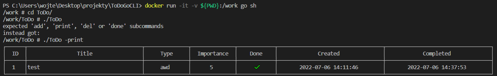
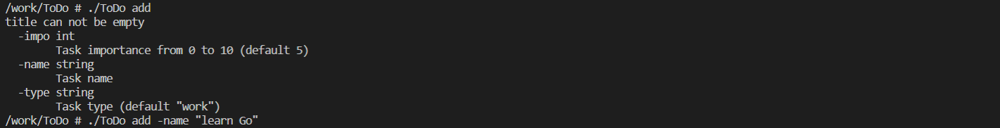
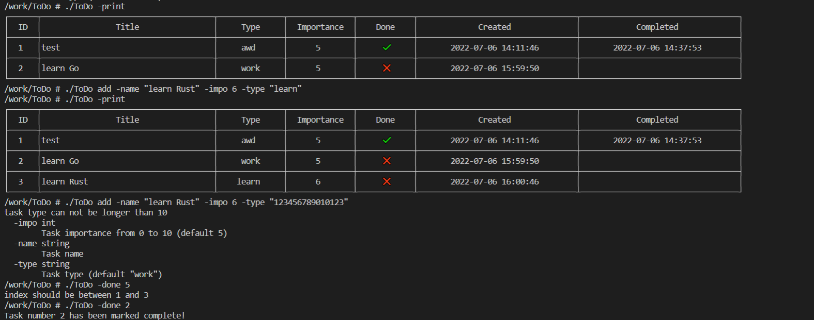
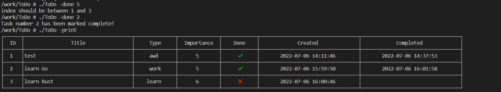
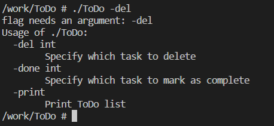
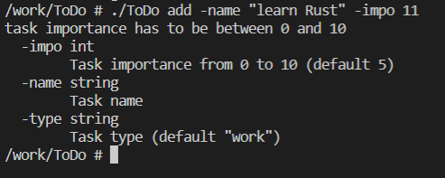
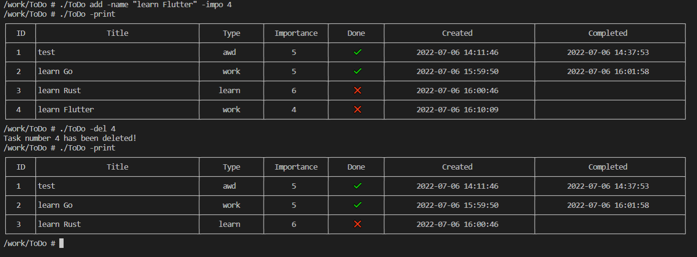

# Simple ToDoGoCLI

The application was written while learning the basics of Go and Docker.   It is a simple to-do list application displayed in the cli console.  It doesn't use any external packages because I wanted to learn built-in golang libraries  

  
## Table of contents:
* [Technologies](#technologies)
* [Illustrations](#illustrations)
 
## Technologies
Project is created with:
* Go

## Illustrations

 
 
 
 
 
 
 
